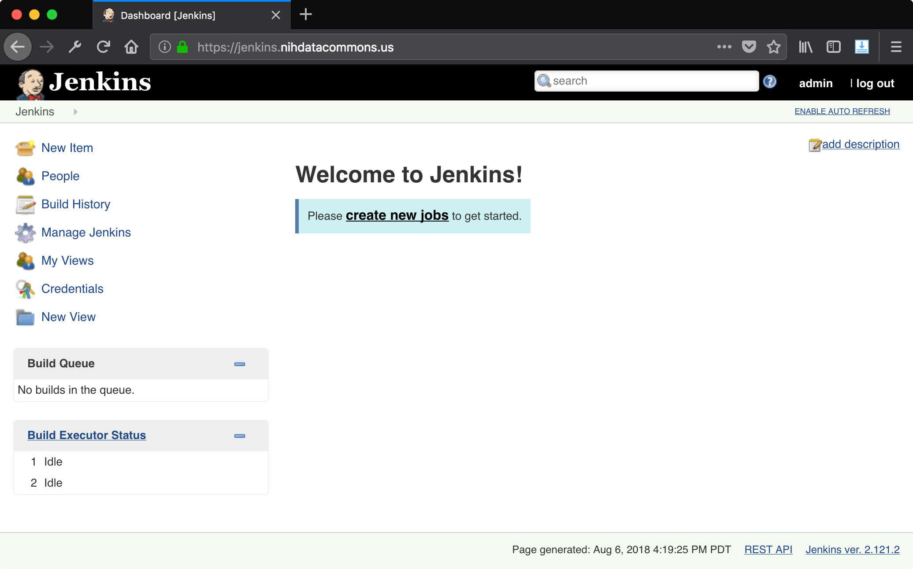
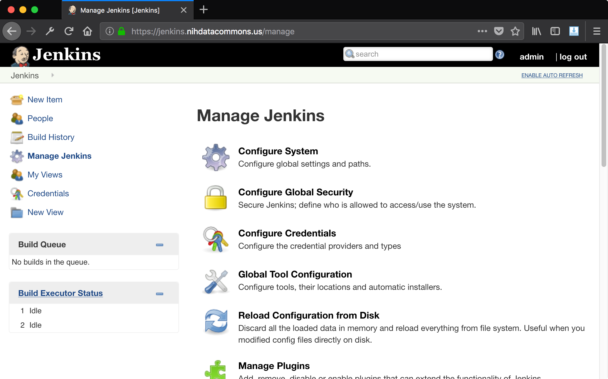
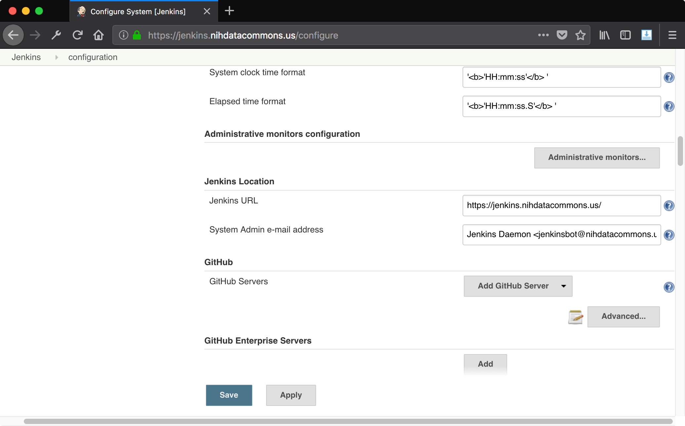

# Configuring Jenkins

To set up your jenkins instance, visit the jenkins configuration page.

## Getting To The Jenkins Configuration Page

Start by logging into your Jenkins instance.

Once you are logged in you should see a view like this:

After clicking "Manage Jenkins" on the left, you should see a list of menu items:

After clicking the first item, "Configure System", you should see a page with
many sections:

Let's go through some settings you can change.

## Nginx Users: Proxy Url

If you are using Jenkins behind a proxy, the first thing you
will want to fix is the URL location of the Jenkins instance.
This should be set to the URL to reach the frontend nginx
server.

In the example below, the Jenkins server is running at 
<http://localhost:8080> while the nginx proxy server is
at <https://jenkins.nihdatacommons.us>. The location of
the Jenkins server is set to <https://jenkins.nihdatacommons.us>.

