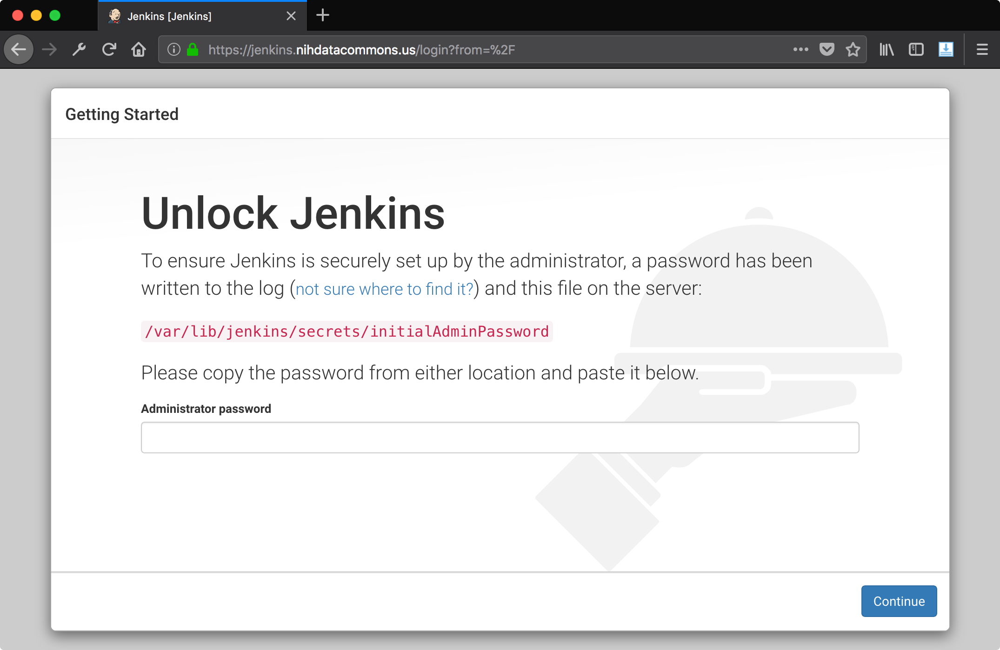
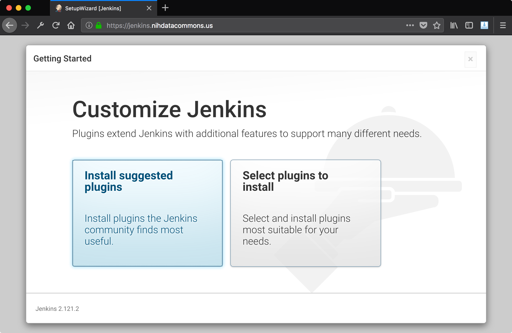
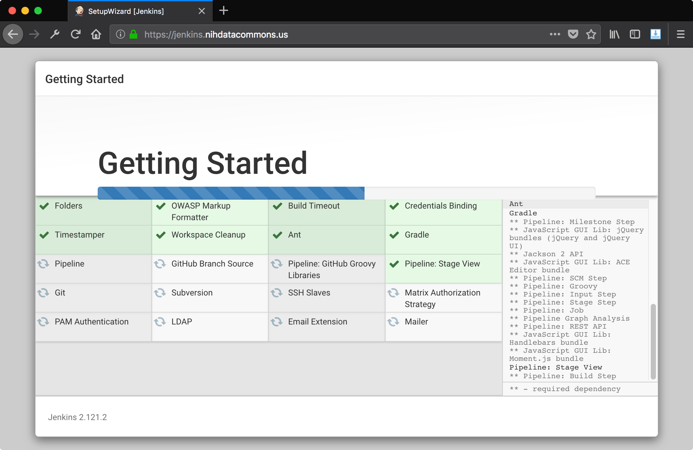

# Installing Jenkins

These instructions assume you are running Ubuntu 16.04.

* See the [jenkins installation page](https://jenkins.io/doc/book/installing/)
  on jenkins.io for coverage of other platforms.

* See [jenkins download page](https://jenkins.io/download/) on jenkins.io
  to download jenkins for your platform.

## Installing Jenkins With Aptitude

To install jenkins, we use aptitude, which installs
jenkins as a system service:

```
wget -q -O - https://pkg.jenkins.io/debian/jenkins-ci.org.key | sudo apt-key add -
echo deb https://pkg.jenkins.io/debian-stable binary/ | sudo tee /etc/apt/sources.list.d/jenkins.list
sudo apt-get update
sudo apt-get install jenkins
```

Now start jenkins running on port 8080:

```
sudo systemctl start jenkins
```

## Starting/Stopping The Jenkins Service

Jenkins will be installed as a system service, so it can be 
started and stopped using systemctl:

```
sudo systemctl start jenkins
sudo systemctl stop jenkins
sudo systemctl restart jenkins
```

## Unlocking Jenkins

Verify your installation went okay by visiting
`http://<server-ip>:8080` in your browser. You should
be asked for an admin password:



Run this from the Jenkins server to get the key:

```
sudo cat /var/lib/jenkins/secrets/initialAdminPassword
```

You can set a new user/password, or you can use
the admin username with the alphanumeric string in
the above file as the password.

Next it will ask if you want to install any plugins. 
I selected the default (the "community choice"
plugins):



This will run through an installation process:



Once you set up an admin user, you should now see
the following login page when you visit your jenkins
instance:


## Installing Nginx Proxy

If you are running Jenkins behind an nginx server (optional), 
this is the proper time to set up the nginx server to reverse 
proxy Jenkins.

See [nginx and jenkins](nginx.md)


