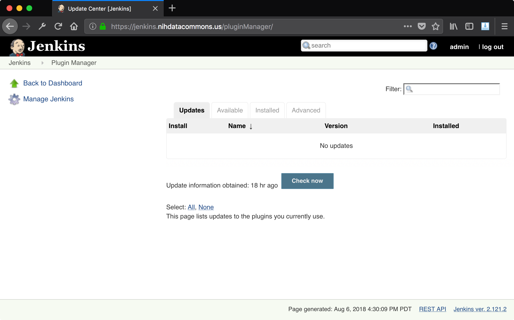

# Installing Jenkins Plugins

The last step for getting our uncle-jenkins server prepared
is to install the right jenkins plugins to perform the tasks
we want.

## plugins

* [**Github Pull Request Builder (GHPRB)**](plugins_ghprb.md) - the GHPRB
  plugin allows Jenkins to create builds on pull requests, which allows Jenkins
  to be integrated as a PR build check step in a repository. See the
  [GHPRB plugin](plugins_ghprb.md) page.

## how to install plugins

Once you are logged in you should see a view like this:

After clicking "Manage Jenkins" on the left, you should see a list of menu items:

Scroll down to the item "Manage Plugins" (gren puzzle piece):

This takes you to the plugin manager view:

Click the Available tab to see a list of plugins that are available on the
server and can be installed into your Jenkins instance:

From here, you can install any of the plugins listed.

