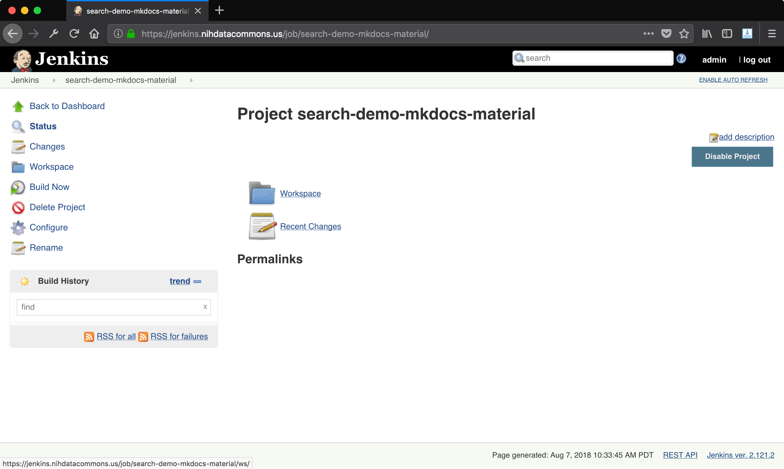
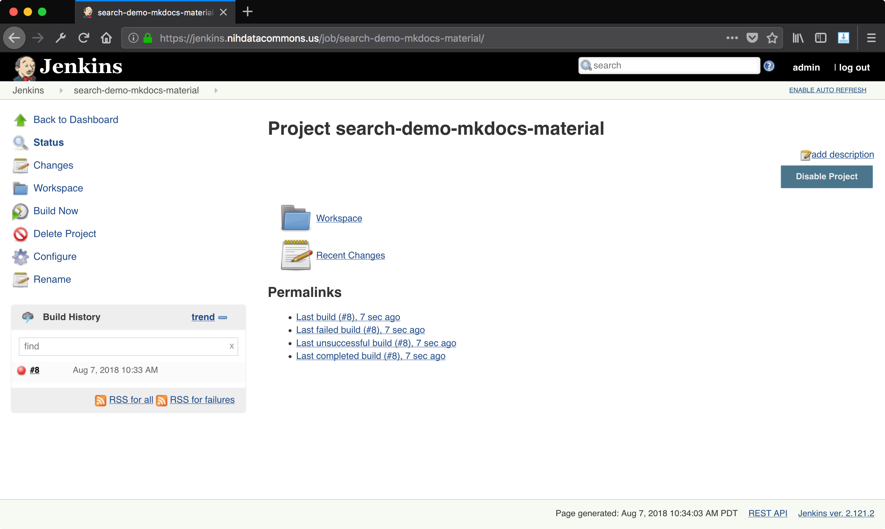

# Jenkins Job: Github Pull Request Builder (GHPRB)

## creating PR builder job

Start by logging into your Jenkins instance.

Once you are logged in you should see a view like this:


Click "Create New Jobs" to create a new job. This job will build
our pull requests and determine if they pass the build process or not,
then update their status accordingly.

Select a job of type "Freestyle":


Once you create the job you will be taken to a page where you can configure
the job. We will edit the "Source Code Management" section and select "Git" 
instead of "None".


Once you select the Git radio button, other options appear. Fill out the Github
repository with the URL that you would normally visit to see the repo in Github.

From the [Github Pull Request Builder README](https://github.com/jenkinsci/ghprb-plugin):

```
    In Branch Specifier, instead of the default */master, enter:

        ${ghprbActualCommit} if you want to use the head of the pull request branch 
            (e.g. refs/pull/4/head); or

        ${sha1}, to use GitHub's tentative merge of the compare and base branches 
            (e.g. refs/pull/4/merge) if the PR can be automatically merged 
            or,
            the head of the pull request branch (e.g. refs/pull/4/head) 
            if they can not be automatically merged.
```


Next, go to the Build Triggers section and check the box for "Github Pull
Request Builder" which will, surprise, give you configuration options. Enter a
list of Github users who are authorized as admins _for this job_. That means
they are allowed to order the bot around, for this job - anywhere this job
applies.


Now your home page should show your new job!


Ready to rock.

## running PR builder job

Once you have created the Github PR Builder job, you are ready to
trigger it. Starting from the Jenkins home page, you should see
your job in the list:


Click the project name to open the project page. On the left side,
you will see a "Build Now" option. Use this to trigger a build job.

Before you trigger a build job, open another pull request for the
GHPRB to try and build.



Once you trigger a build, it will show up in a box on the bottom 
left part of the page, labeled "Build History". 



Click on a build number to open its page:


From here, you can also view the output log from the build job.


## dealing with failed build

Your first build will probably result in a failure:


The error message is:

    ERROR: Couldn't find any revision to build. Verify the repository and branch configuration for this job.
    Finished: FAILURE

This issue is caused by a change in Jenkins and how it deals with exporting
variables. See [this issue](https://github.com/jenkinsci/ghprb-plugin/issues/341)
in the GHPRB plugin repo, and [this announcement](https://jenkins.io/blog/2016/05/11/security-update/)
from Jenkins about what changed and broke GHPRB.

To make this work, we need to modify the Jenkins startup service
in `/etc/init.d/jenkins` and add flags to the Jenkins run line.
Specifically, change this line (line 157):

    $SU -l $JENKINS_USER --shell=/bin/bash -c "$DAEMON $DAEMON_ARGS -- $JAVA $JAVA_ARGS  -jar $JENKINS_WAR $JENKINS_ARGS" || return 2

to this line:

    $SU -l $JENKINS_USER --shell=/bin/bash -c "$DAEMON $DAEMON_ARGS -- $JAVA $JAVA_ARGS -Dhudson.model.ParametersAction.safeParameters=ghprbActualCommit,ghprbActualCommitAuthor,ghprbActualCommitAuthorEmail,ghprbAuthorRepoGitUrl,ghprbCommentBody,ghprbCredentialsId,ghprbGhRepository,ghprbPullAuthorEmail,ghprbPullAuthorLogin,ghprbPullAuthorLoginMention,ghprbPullDescription,ghprbPullId,ghprbPullLink,ghprbPullLongDescription,ghprbPullTitle,ghprbSourceBranch,ghprbTargetBranch,ghprbTriggerAuthor,ghprbTriggerAuthorEmail,ghprbTriggerAuthorLogin,ghprbTriggerAuthorLoginMention,GIT_BRANCH,sha1 -jar $JENKINS_WAR $JENKINS_ARGS" || return 2


