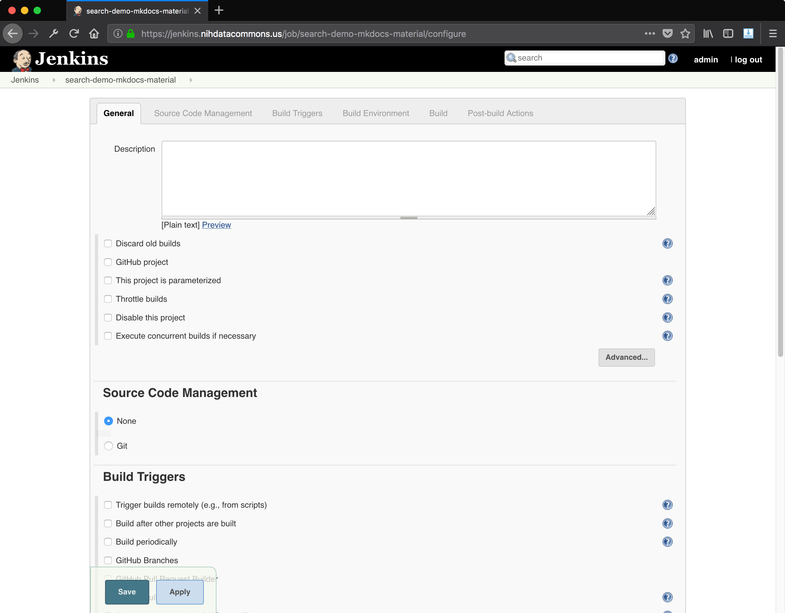
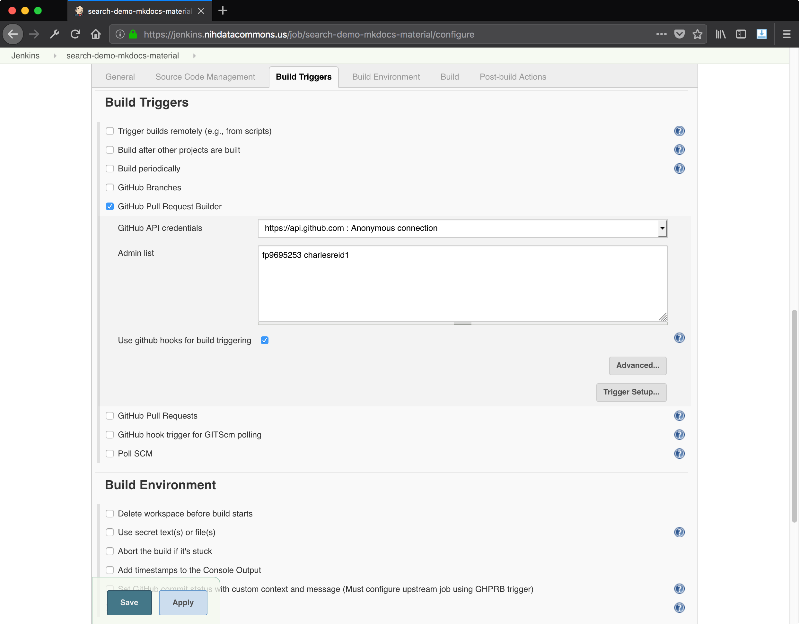
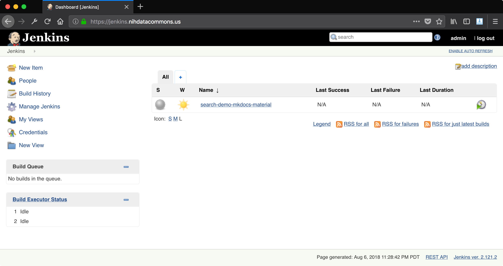

# Jenkins Job: Github Pull Request Builder (GHPRB)

## creating PR builder job

Start by logging into your Jenkins instance.

Once you are logged in you should see a view like this:


Click "Create New Jobs" to create a new job. This job will build
our pull requests and determine if they pass the build process or not,
then update their status accordingly.

Select a job of type "Freestyle":


Once you create the job you will be taken to a page where you can configure
the job. We will edit the "Source Code Management" section and select "Git" 
instead of "None".



Once you select the Git radio button, other options appear. Fill out the Github
repository with the URL that you would normally visit to see the repo in Github.

From the [Github Pull Request Builder README](https://github.com/jenkinsci/ghprb-plugin):

```
    In Branch Specifier, instead of the default */master, enter:

        ${ghprbActualCommit} if you want to use the head of the pull request branch 
            (e.g. refs/pull/4/head); or

        ${sha1}, to use GitHub's tentative merge of the compare and base branches 
            (e.g. refs/pull/4/merge) if the PR can be automatically merged 
            or,
            the head of the pull request branch (e.g. refs/pull/4/head) 
            if they can not be automatically merged.
```


Next, go to the Build Triggers section and check the box for "Github Pull
Request Builder" which will, surprise, give you configuration options. Enter a
list of Github users who are authorized as admins _for this job_. That means
they are allowed to order the bot around, for this job - anywhere this job
applies.



Now your home page should show your new job!




